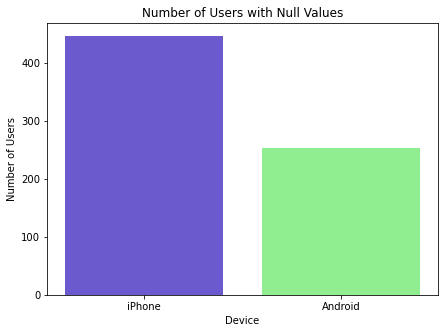
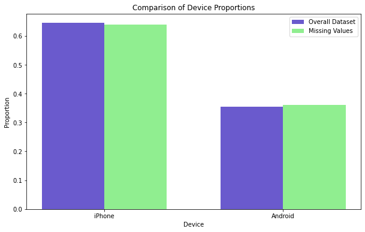
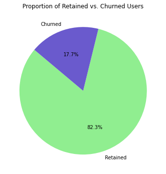
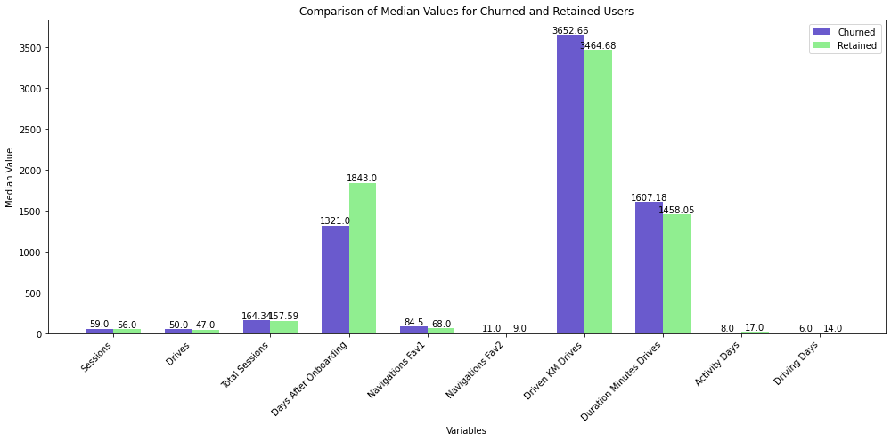
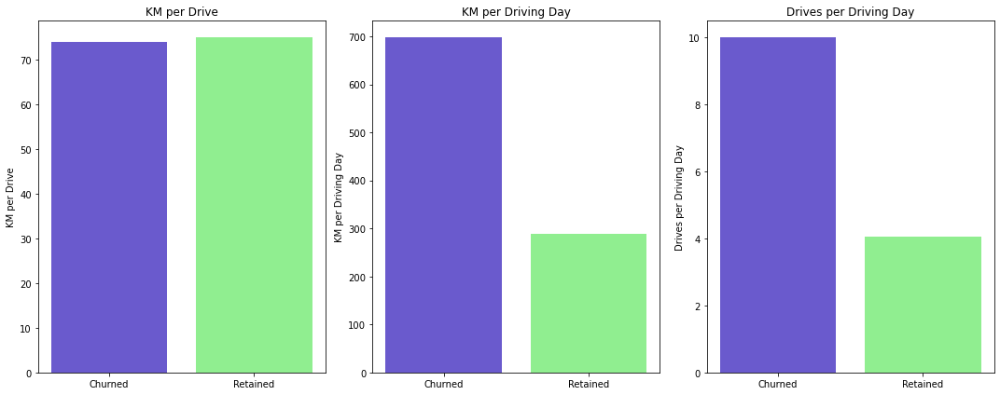
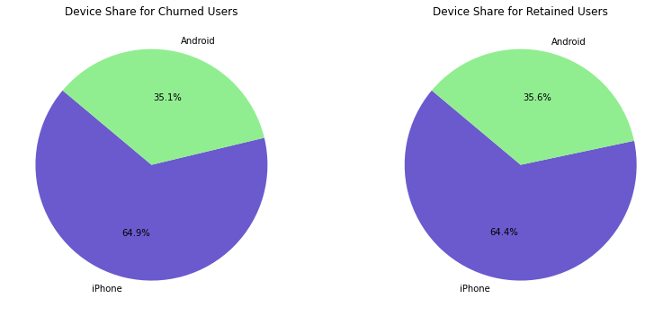

# **Waze Churn Analysis Project**

**The purpose** of this project is to investigate and understand the data provided.

**The goal** is to use a dataframe contructed within Python, perform a cursory inspection of the provided dataset, and inform team members of your findings.
<br/>

*This activity has three parts:*

**Part 1:** Understand the situation
* How can you best prepare to understand and organize the provided information?

**Part 2:** Understand the data

* Create a pandas dataframe for data learning, future exploratory data analysis (EDA), and statistical activities

* Compile summary information about the data to inform next steps

**Part 3:** Understand the variables

* Use insights from your examination of the summary data to guide deeper investigation into variables
<br/>

## **PACE: Plan**

Consider the questions in your PACE Strategy Document and those below to craft your response:

### **Task 1. Understand the situation**

*   How can you best prepare to understand and organize the provided driver data?

*Begin by exploring your dataset and consider reviewing the Data Dictionary.*

        Step 1: Familiarize Yourself with the Data Dictionary
    Review the data dictionary to understand the purpose and description of each column. This provides context and helps in interpreting the data correctly.

        Step 2: Load the Data into a Pandas DataFrame
    Read the dataset into a pandas DataFrame for ease of manipulation and analysis.

        Step 3: Perform Initial Data Inspection
    Display the First Few Rows: Get a quick overview of the data.
    Check Data Types: Ensure each column has the appropriate data type.
    Check for Missing Values: Identify any columns with missing data.
    Generate Descriptive Statistics: Summarize the central tendency, dispersion, and shape of the dataset’s distribution.

        Step 4: Visualize Key Metrics
    Histograms: To understand the distribution of numerical variables.
    Box Plots: To identify outliers and understand the spread of the data.
    Scatter Plots: To explore relationships between numerical variables.
    Correlation Heatmap: To visualize correlations between different metrics.
    Bar Charts: To understand the distribution of categorical variables like verified_status.

        Step 5: Clean and Prepare Data
    Handle Missing Values: Decide on strategies for dealing with missing data (e.g., imputation, removal).
    Handle Outliers: Identify and decide how to handle outliers.
    Feature Engineering: Create new features if necessary for better analysis and modeling.

        Step 6: Document Findings
    Summarize Initial Observations: Document insights and observations from the initial data inspection.
    Prepare for Further Analysis: Outline the next steps for more in-depth EDA, hypothesis testing, and statistical analysis.


## **PACE: Analyze**

Consider the questions in your PACE Strategy Document to reflect on the Analyze stage.

### **Task 2a. Imports and data loading**

Start by importing the packages that you will need to load and explore the dataset. Make sure to use the following import statements:

*   `import pandas as pd`
*   `import numpy as np`

```python
# Import packages for data manipulation
import pandas as pd
import numpy as np
import matplotlib.pyplot as plt
import seaborn as sns
```
Then, load the dataset into a dataframe. Creating a dataframe will help you conduct data manipulation, exploratory data analysis (EDA), and statistical activities.

**Note:** As shown in this cell, the dataset has been automatically loaded in. No need to download the .csv file, or provide more code, in order to access the dataset and proceed with this lab.

```python
# Load dataset into dataframe
df = pd.read_csv('waze_dataset.csv')
```

### **Task 2b. Summary information**

View and inspect summary information about the dataframe by **coding the following:**

1.   df.head(10)
2.   df.info()

*Consider the following questions:*

1. When reviewing the `df.head()` output, are there any variables that have missing values?

2. When reviewing the `df.info()` output, what are the data types? How many rows and columns do you have?

3. Does the dataset have any missing values?

```python
# Display the First Few Rows: Get a quick overview of the data
df.head(10)
```

<div>
<style scoped>
    .dataframe tbody tr th:only-of-type {
        vertical-align: middle;
    }

    .dataframe tbody tr th {
        vertical-align: top;
    }

    .dataframe thead th {
        text-align: right;
    }
</style>
<table border="1" class="dataframe">
  <thead>
    <tr style="text-align: right;">
      <th></th>
      <th>ID</th>
      <th>label</th>
      <th>sessions</th>
      <th>drives</th>
      <th>total_sessions</th>
      <th>n_days_after_onboarding</th>
      <th>total_navigations_fav1</th>
      <th>total_navigations_fav2</th>
      <th>driven_km_drives</th>
      <th>duration_minutes_drives</th>
      <th>activity_days</th>
      <th>driving_days</th>
      <th>device</th>
    </tr>
  </thead>
  <tbody>
    <tr>
      <th>0</th>
      <td>0</td>
      <td>retained</td>
      <td>283</td>
      <td>226</td>
      <td>296.748273</td>
      <td>2276</td>
      <td>208</td>
      <td>0</td>
      <td>2628.845068</td>
      <td>1985.775061</td>
      <td>28</td>
      <td>19</td>
      <td>Android</td>
    </tr>
    <tr>
      <th>1</th>
      <td>1</td>
      <td>retained</td>
      <td>133</td>
      <td>107</td>
      <td>326.896596</td>
      <td>1225</td>
      <td>19</td>
      <td>64</td>
      <td>13715.920550</td>
      <td>3160.472914</td>
      <td>13</td>
      <td>11</td>
      <td>iPhone</td>
    </tr>
    <tr>
      <th>2</th>
      <td>2</td>
      <td>retained</td>
      <td>114</td>
      <td>95</td>
      <td>135.522926</td>
      <td>2651</td>
      <td>0</td>
      <td>0</td>
      <td>3059.148818</td>
      <td>1610.735904</td>
      <td>14</td>
      <td>8</td>
      <td>Android</td>
    </tr>
    <tr>
      <th>3</th>
      <td>3</td>
      <td>retained</td>
      <td>49</td>
      <td>40</td>
      <td>67.589221</td>
      <td>15</td>
      <td>322</td>
      <td>7</td>
      <td>913.591123</td>
      <td>587.196542</td>
      <td>7</td>
      <td>3</td>
      <td>iPhone</td>
    </tr>
    <tr>
      <th>4</th>
      <td>4</td>
      <td>retained</td>
      <td>84</td>
      <td>68</td>
      <td>168.247020</td>
      <td>1562</td>
      <td>166</td>
      <td>5</td>
      <td>3950.202008</td>
      <td>1219.555924</td>
      <td>27</td>
      <td>18</td>
      <td>Android</td>
    </tr>
    <tr>
      <th>5</th>
      <td>5</td>
      <td>retained</td>
      <td>113</td>
      <td>103</td>
      <td>279.544437</td>
      <td>2637</td>
      <td>0</td>
      <td>0</td>
      <td>901.238699</td>
      <td>439.101397</td>
      <td>15</td>
      <td>11</td>
      <td>iPhone</td>
    </tr>
    <tr>
      <th>6</th>
      <td>6</td>
      <td>retained</td>
      <td>3</td>
      <td>2</td>
      <td>236.725314</td>
      <td>360</td>
      <td>185</td>
      <td>18</td>
      <td>5249.172828</td>
      <td>726.577205</td>
      <td>28</td>
      <td>23</td>
      <td>iPhone</td>
    </tr>
    <tr>
      <th>7</th>
      <td>7</td>
      <td>retained</td>
      <td>39</td>
      <td>35</td>
      <td>176.072845</td>
      <td>2999</td>
      <td>0</td>
      <td>0</td>
      <td>7892.052468</td>
      <td>2466.981741</td>
      <td>22</td>
      <td>20</td>
      <td>iPhone</td>
    </tr>
    <tr>
      <th>8</th>
      <td>8</td>
      <td>retained</td>
      <td>57</td>
      <td>46</td>
      <td>183.532018</td>
      <td>424</td>
      <td>0</td>
      <td>26</td>
      <td>2651.709764</td>
      <td>1594.342984</td>
      <td>25</td>
      <td>20</td>
      <td>Android</td>
    </tr>
    <tr>
      <th>9</th>
      <td>9</td>
      <td>churned</td>
      <td>84</td>
      <td>68</td>
      <td>244.802115</td>
      <td>2997</td>
      <td>72</td>
      <td>0</td>
      <td>6043.460295</td>
      <td>2341.838528</td>
      <td>7</td>
      <td>3</td>
      <td>iPhone</td>
    </tr>
  </tbody>
</table>
</div>

```python
# Check Data Types: Ensure each column has the appropriate data type
df.info()
```

    <class 'pandas.core.frame.DataFrame'>
    RangeIndex: 14999 entries, 0 to 14998
    Data columns (total 13 columns):
     #   Column                   Non-Null Count  Dtype  
    ---  ------                   --------------  -----  
     0   ID                       14999 non-null  int64  
     1   label                    14299 non-null  object 
     2   sessions                 14999 non-null  int64  
     3   drives                   14999 non-null  int64  
     4   total_sessions           14999 non-null  float64
     5   n_days_after_onboarding  14999 non-null  int64  
     6   total_navigations_fav1   14999 non-null  int64  
     7   total_navigations_fav2   14999 non-null  int64  
     8   driven_km_drives         14999 non-null  float64
     9   duration_minutes_drives  14999 non-null  float64
     10  activity_days            14999 non-null  int64  
     11  driving_days             14999 non-null  int64  
     12  device                   14999 non-null  object 
    dtypes: float64(3), int64(8), object(2)
    memory usage: 1.5+ MB

**Task 2b**

**Question 1** When reviewing the df.head() output, are there any variables that have missing values?

    Based on the df.head() output shown in the image, there do not appear to be any missing values in the first few rows of the dataset. All columns seem to have values filled in for each of the displayed rows.

    However, to confirm whether any columns have missing values across the entire dataset, you would typically use the 
    df.isnull().sum() method in Pandas, which provides a count of missing values in each column.

**Question 2** When reviewing the df.info() output, what are the data types? How many rows and columns do you have?

    There are 14,999 row entries and 13 columns: float64(3), int64(8), object(2).

**Question 3** Does the dataset have any missing values?

    Yes, the dataset has missing values. Specifically, the label column has 700 missing values (14,299 non-null entries out of a total of 14,999 rows). All other columns have 14,999 non-null entries, so they do not contain any missing values.
    
### **Task 2c. Null values and summary statistics**

Compare the summary statistics of the 700 rows that are missing labels with summary statistics of the rows that are not missing any values.

**Question:** Is there a discernible difference between the two populations?

```python
# Isolate rows with null values
rows_with_nulls = df[df['label'].isnull()]

# Display summary stats of rows with null values
rows_with_nulls.describe()
```

<div>
<style scoped>
    .dataframe tbody tr th:only-of-type {
        vertical-align: middle;
    }

    .dataframe tbody tr th {
        vertical-align: top;
    }

    .dataframe thead th {
        text-align: right;
    }
</style>
<table border="1" class="dataframe">
  <thead>
    <tr style="text-align: right;">
      <th></th>
      <th>ID</th>
      <th>sessions</th>
      <th>drives</th>
      <th>total_sessions</th>
      <th>n_days_after_onboarding</th>
      <th>total_navigations_fav1</th>
      <th>total_navigations_fav2</th>
      <th>driven_km_drives</th>
      <th>duration_minutes_drives</th>
      <th>activity_days</th>
      <th>driving_days</th>
    </tr>
  </thead>
  <tbody>
    <tr>
      <th>count</th>
      <td>700.000000</td>
      <td>700.000000</td>
      <td>700.000000</td>
      <td>700.000000</td>
      <td>700.000000</td>
      <td>700.000000</td>
      <td>700.000000</td>
      <td>700.000000</td>
      <td>700.000000</td>
      <td>700.000000</td>
      <td>700.000000</td>
    </tr>
    <tr>
      <th>mean</th>
      <td>7405.584286</td>
      <td>80.837143</td>
      <td>67.798571</td>
      <td>198.483348</td>
      <td>1709.295714</td>
      <td>118.717143</td>
      <td>30.371429</td>
      <td>3935.967029</td>
      <td>1795.123358</td>
      <td>15.382857</td>
      <td>12.125714</td>
    </tr>
    <tr>
      <th>std</th>
      <td>4306.900234</td>
      <td>79.987440</td>
      <td>65.271926</td>
      <td>140.561715</td>
      <td>1005.306562</td>
      <td>156.308140</td>
      <td>46.306984</td>
      <td>2443.107121</td>
      <td>1419.242246</td>
      <td>8.772714</td>
      <td>7.626373</td>
    </tr>
    <tr>
      <th>min</th>
      <td>77.000000</td>
      <td>0.000000</td>
      <td>0.000000</td>
      <td>5.582648</td>
      <td>16.000000</td>
      <td>0.000000</td>
      <td>0.000000</td>
      <td>290.119811</td>
      <td>66.588493</td>
      <td>0.000000</td>
      <td>0.000000</td>
    </tr>
    <tr>
      <th>25%</th>
      <td>3744.500000</td>
      <td>23.000000</td>
      <td>20.000000</td>
      <td>94.056340</td>
      <td>869.000000</td>
      <td>4.000000</td>
      <td>0.000000</td>
      <td>2119.344818</td>
      <td>779.009271</td>
      <td>8.000000</td>
      <td>6.000000</td>
    </tr>
    <tr>
      <th>50%</th>
      <td>7443.000000</td>
      <td>56.000000</td>
      <td>47.500000</td>
      <td>177.255925</td>
      <td>1650.500000</td>
      <td>62.500000</td>
      <td>10.000000</td>
      <td>3421.156721</td>
      <td>1414.966279</td>
      <td>15.000000</td>
      <td>12.000000</td>
    </tr>
    <tr>
      <th>75%</th>
      <td>11007.000000</td>
      <td>112.250000</td>
      <td>94.000000</td>
      <td>266.058022</td>
      <td>2508.750000</td>
      <td>169.250000</td>
      <td>43.000000</td>
      <td>5166.097373</td>
      <td>2443.955404</td>
      <td>23.000000</td>
      <td>18.000000</td>
    </tr>
    <tr>
      <th>max</th>
      <td>14993.000000</td>
      <td>556.000000</td>
      <td>445.000000</td>
      <td>1076.879741</td>
      <td>3498.000000</td>
      <td>1096.000000</td>
      <td>352.000000</td>
      <td>15135.391280</td>
      <td>9746.253023</td>
      <td>31.000000</td>
      <td>30.000000</td>
    </tr>
  </tbody>
</table>
</div>

```python
# Isolate rows without null values
rows_without_nulls = df[df['label'].notnull()]

# Display summary stats of rows without null values
rows_without_nulls.describe()
```

<div>
<style scoped>
    .dataframe tbody tr th:only-of-type {
        vertical-align: middle;
    }

    .dataframe tbody tr th {
        vertical-align: top;
    }

    .dataframe thead th {
        text-align: right;
    }
</style>
<table border="1" class="dataframe">
  <thead>
    <tr style="text-align: right;">
      <th></th>
      <th>ID</th>
      <th>sessions</th>
      <th>drives</th>
      <th>total_sessions</th>
      <th>n_days_after_onboarding</th>
      <th>total_navigations_fav1</th>
      <th>total_navigations_fav2</th>
      <th>driven_km_drives</th>
      <th>duration_minutes_drives</th>
      <th>activity_days</th>
      <th>driving_days</th>
    </tr>
  </thead>
  <tbody>
    <tr>
      <th>count</th>
      <td>14299.000000</td>
      <td>14299.000000</td>
      <td>14299.000000</td>
      <td>14299.000000</td>
      <td>14299.000000</td>
      <td>14299.000000</td>
      <td>14299.000000</td>
      <td>14299.000000</td>
      <td>14299.000000</td>
      <td>14299.000000</td>
      <td>14299.000000</td>
    </tr>
    <tr>
      <th>mean</th>
      <td>7503.573117</td>
      <td>80.623820</td>
      <td>67.255822</td>
      <td>189.547409</td>
      <td>1751.822505</td>
      <td>121.747395</td>
      <td>29.638296</td>
      <td>4044.401535</td>
      <td>1864.199794</td>
      <td>15.544653</td>
      <td>12.182530</td>
    </tr>
    <tr>
      <th>std</th>
      <td>4331.207621</td>
      <td>80.736502</td>
      <td>65.947295</td>
      <td>136.189764</td>
      <td>1008.663834</td>
      <td>147.713428</td>
      <td>45.350890</td>
      <td>2504.977970</td>
      <td>1448.005047</td>
      <td>9.016088</td>
      <td>7.833835</td>
    </tr>
    <tr>
      <th>min</th>
      <td>0.000000</td>
      <td>0.000000</td>
      <td>0.000000</td>
      <td>0.220211</td>
      <td>4.000000</td>
      <td>0.000000</td>
      <td>0.000000</td>
      <td>60.441250</td>
      <td>18.282082</td>
      <td>0.000000</td>
      <td>0.000000</td>
    </tr>
    <tr>
      <th>25%</th>
      <td>3749.500000</td>
      <td>23.000000</td>
      <td>20.000000</td>
      <td>90.457733</td>
      <td>878.500000</td>
      <td>10.000000</td>
      <td>0.000000</td>
      <td>2217.319909</td>
      <td>840.181344</td>
      <td>8.000000</td>
      <td>5.000000</td>
    </tr>
    <tr>
      <th>50%</th>
      <td>7504.000000</td>
      <td>56.000000</td>
      <td>48.000000</td>
      <td>158.718571</td>
      <td>1749.000000</td>
      <td>71.000000</td>
      <td>9.000000</td>
      <td>3496.545617</td>
      <td>1479.394387</td>
      <td>16.000000</td>
      <td>12.000000</td>
    </tr>
    <tr>
      <th>75%</th>
      <td>11257.500000</td>
      <td>111.000000</td>
      <td>93.000000</td>
      <td>253.540450</td>
      <td>2627.500000</td>
      <td>178.000000</td>
      <td>43.000000</td>
      <td>5299.972162</td>
      <td>2466.928876</td>
      <td>23.000000</td>
      <td>19.000000</td>
    </tr>
    <tr>
      <th>max</th>
      <td>14998.000000</td>
      <td>743.000000</td>
      <td>596.000000</td>
      <td>1216.154633</td>
      <td>3500.000000</td>
      <td>1236.000000</td>
      <td>415.000000</td>
      <td>21183.401890</td>
      <td>15851.727160</td>
      <td>31.000000</td>
      <td>30.000000</td>
    </tr>
  </tbody>
</table>
</div>

**Task 2c**

**Question:** Is there a discernible difference between the two populations?

    There are no significant or alarming differences between the two populations, suggesting that the missing labels may not be systematically associated with a particular pattern or behavior in the data. 
    
    >>> Slight differences in the mean and maximum values for certain metrics (e.g., total_sessions, driven_km_drives) could be further explored to determine if they have any meaningful impact.

### **Task 2d. Null values - device counts**

Next, check the two populations with respect to the `device` variable.

**Question:** How many iPhone users had null values and how many Android users had null values?

```python
# Get count of null values by device
null_counts_by_device = df[df['label'].isnull()].groupby('device').size()
null_counts_by_device
```


    device
    Android    253
    iPhone     447
    dtype: int64

```python
# Data
devices = ['iPhone', 'Android']
counts = [447, 253]

# Plotting the bar chart
plt.figure(figsize=(7, 5))
plt.bar(devices, counts, color=['slateblue', 'lightgreen'])

# Adding title and labels
plt.title('Number of Users with Null Values')
plt.xlabel('Device')
plt.ylabel('Number of Users')

# Display the plot
plt.show()
```


**Answer**: 447 iPhone users and 253 Android users had null values.

Now, of the rows with null values, calculate the percentage with each device&mdash;Android and iPhone. You can do this directly with the [`value_counts()`](https://pandas.pydata.org/docs/reference/api/pandas.Series.value_counts.html) function.

```python
# Calculate % of iPhone nulls and Android nulls

# Filter the rows with null values in the 'label' column
rows_with_nulls = df[df['label'].isnull()]

# Calculate the percentage of rows with each device type (Android, iPhone)
device_percentage_with_nulls = rows_with_nulls['device'].value_counts(normalize=True)
device_percentage_with_nulls
```


    iPhone     0.638571
    Android    0.361429
    Name: device, dtype: float64

How does this compare to the device ratio in the full dataset?

```python
# Calculate % of iPhone users and Android users in full dataset
device_percentage = df['device'].value_counts(normalize=True)
device_percentage
```


    iPhone     0.644843
    Android    0.355157
    Name: device, dtype: float64

```python
# Data
devices = ['iPhone', 'Android']
overall = [0.644843, 0.355157]
missing = [0.638571, 0.361429]

# Plotting
bar_width = 0.35
indices = np.arange(len(devices))

plt.figure(figsize=(10, 6))
plt.bar(indices, overall, bar_width, label='Overall Dataset', color='slateblue')
plt.bar(indices + bar_width, missing, bar_width, label='Missing Values', color='lightgreen')

plt.title('Comparison of Device Proportions')
plt.xlabel('Device')
plt.ylabel('Proportion')
plt.xticks(indices + bar_width / 2, devices)
plt.legend()
plt.show()
```



The percentage of missing values by each device is consistent with their representation in the data overall.

There is nothing to suggest a non-random cause of the missing data.

Examine the counts and percentages of users who churned vs. those who were retained. How many of each group are represented in the data?

```python
# Calculate counts of churned vs. retained
label_counts = df['label'].value_counts()
print(label_counts)
print('')

label_percentages = df['label'].value_counts(normalize=True)
print(label_percentages)
```

    retained    11763
    churned      2536
    Name: label, dtype: int64
    
    retained    0.822645
    churned     0.177355
    Name: label, dtype: float64


```python
# Data for the pie chart
labels = ['Retained', 'Churned']
sizes = [0.822645, 0.177355]
colors = ['lightgreen', 'slateblue']  # Colors for each slice

# Plotting the pie chart
plt.figure(figsize=(6, 6))
plt.pie(sizes, labels=labels, autopct='%1.1f%%', startangle=140, colors=colors)

# Adding a title
plt.title('Proportion of Retained vs. Churned Users')

# Display the plot
plt.show()
```


This dataset contains 82% retained users and 18% churned users.

Next, compare the medians of each variable for churned and retained users. The reason for calculating the median and not the mean is that you don't want outliers to unduly affect the portrayal of a typical user. Notice, for example, that the maximum value in the `driven_km_drives` column is 21,183 km. That's more than half the circumference of the earth!

```python
# Calculate median values of all columns for churned and retained users
df.groupby(['label']).median()
```

<div>
<style scoped>
    .dataframe tbody tr th:only-of-type {
        vertical-align: middle;
    }

    .dataframe tbody tr th {
        vertical-align: top;
    }

    .dataframe thead th {
        text-align: right;
    }
</style>
<table border="1" class="dataframe">
  <thead>
    <tr style="text-align: right;">
      <th></th>
      <th>ID</th>
      <th>sessions</th>
      <th>drives</th>
      <th>total_sessions</th>
      <th>n_days_after_onboarding</th>
      <th>total_navigations_fav1</th>
      <th>total_navigations_fav2</th>
      <th>driven_km_drives</th>
      <th>duration_minutes_drives</th>
      <th>activity_days</th>
      <th>driving_days</th>
    </tr>
    <tr>
      <th>label</th>
      <th></th>
      <th></th>
      <th></th>
      <th></th>
      <th></th>
      <th></th>
      <th></th>
      <th></th>
      <th></th>
      <th></th>
      <th></th>
    </tr>
  </thead>
  <tbody>
    <tr>
      <th>churned</th>
      <td>7477.5</td>
      <td>59.0</td>
      <td>50.0</td>
      <td>164.339042</td>
      <td>1321.0</td>
      <td>84.5</td>
      <td>11.0</td>
      <td>3652.655666</td>
      <td>1607.183785</td>
      <td>8.0</td>
      <td>6.0</td>
    </tr>
    <tr>
      <th>retained</th>
      <td>7509.0</td>
      <td>56.0</td>
      <td>47.0</td>
      <td>157.586756</td>
      <td>1843.0</td>
      <td>68.0</td>
      <td>9.0</td>
      <td>3464.684614</td>
      <td>1458.046141</td>
      <td>17.0</td>
      <td>14.0</td>
    </tr>
  </tbody>
</table>
</div>

```python
# Data preparation
labels = ['Sessions', 'Drives', 'Total Sessions', 'Days After Onboarding', 
          'Navigations Fav1', 'Navigations Fav2', 'Driven KM Drives', 
          'Duration Minutes Drives', 'Activity Days', 'Driving Days']

churned_medians = [59, 50, 164.33904, 1321, 84.5, 11, 3652.6557, 1607.1838, 8, 6]
retained_medians = [56, 47, 157.58676, 1843, 68, 9, 3464.6846, 1458.0461, 17, 14]

x = np.arange(len(labels))  # Label locations
width = 0.35  # Width of the bars

# Plotting
fig, ax = plt.subplots(figsize=(14, 7))
bars1 = ax.bar(x - width/2, churned_medians, width, label='Churned', color='slateblue')
bars2 = ax.bar(x + width/2, retained_medians, width, label='Retained', color='lightgreen')

# Adding labels and title
ax.set_xlabel('Variables')
ax.set_ylabel('Median Value')
ax.set_title('Comparison of Median Values for Churned and Retained Users')
ax.set_xticks(x)
ax.set_xticklabels(labels, rotation=45, ha="right")
ax.legend()

# Adding the median values on top of the bars
for bar in bars1:
    yval = bar.get_height()
    ax.text(bar.get_x() + bar.get_width()/2, yval + 0.05, round(yval, 2), ha='center', va='bottom')
for bar in bars2:
    yval = bar.get_height()
    ax.text(bar.get_x() + bar.get_width()/2, yval + 0.05, round(yval, 2), ha='center', va='bottom')

plt.tight_layout()
plt.show()
```



This offers an interesting snapshot of the two groups, churned vs. retained:

Users who churned averaged ~3 more drives in the last month than retained users, but retained users used the app on over twice as many days as churned users in the same time period.

The median churned user drove ~200 more kilometers and 2.5 more hours during the last month than the median retained user.

It seems that churned users had more drives in fewer days, and their trips were farther and longer in duration. Perhaps this is suggestive of a user profile. Continue exploring!

Calculate the median kilometers per drive in the last month for both retained and churned users.

Begin by dividing the `driven_km_drives` column by the `drives` column. Then, group the results by churned/retained and calculate the median km/drive of each group.

```python
# Add a column to df called `km_per_drive`
df['km_per_drive'] = df['driven_km_drives'] / df['drives']

# Group by `label`, calculate the median, and isolate for km per drive
median_km_per_drive = df.groupby(['label']).median('km_per_drive')[['km_per_drive']]
median_km_per_drive
```

<div>
<style scoped>
    .dataframe tbody tr th:only-of-type {
        vertical-align: middle;
    }

    .dataframe tbody tr th {
        vertical-align: top;
    }

    .dataframe thead th {
        text-align: right;
    }
</style>
<table border="1" class="dataframe">
  <thead>
    <tr style="text-align: right;">
      <th></th>
      <th>km_per_drive</th>
    </tr>
    <tr>
      <th>label</th>
      <th></th>
    </tr>
  </thead>
  <tbody>
    <tr>
      <th>churned</th>
      <td>74.109416</td>
    </tr>
    <tr>
      <th>retained</th>
      <td>75.014702</td>
    </tr>
  </tbody>
</table>
</div>

The median retained user drove about one more kilometer per drive than the median churned user. How many kilometers per driving day was this?

To calculate this statistic, repeat the steps above using `driving_days` instead of `drives`.

```python
# Add a column to df called `km_per_driving_day`
df['km_per_driving_day'] = df['driven_km_drives'] / df['driving_days']

# Group by `label`, calculate the median, and isolate for km per driving day
median_km_per_drive = df.groupby(['label']).median('km_per_driving_day')[['km_per_driving_day']]
median_km_per_drive
```

<div>
<style scoped>
    .dataframe tbody tr th:only-of-type {
        vertical-align: middle;
    }

    .dataframe tbody tr th {
        vertical-align: top;
    }

    .dataframe thead th {
        text-align: right;
    }
</style>
<table border="1" class="dataframe">
  <thead>
    <tr style="text-align: right;">
      <th></th>
      <th>km_per_driving_day</th>
    </tr>
    <tr>
      <th>label</th>
      <th></th>
    </tr>
  </thead>
  <tbody>
    <tr>
      <th>churned</th>
      <td>697.541999</td>
    </tr>
    <tr>
      <th>retained</th>
      <td>289.549333</td>
    </tr>
  </tbody>
</table>
</div>

Now, calculate the median number of drives per driving day for each group.

```python
# Add a column to df called `drives_per_driving_day`
df['drives_per_driving_day'] = df['drives'] / df['driving_days']

# Group by `label`, calculate the median, and isolate for drives per driving day
median_km_per_drive = df.groupby(['label']).median('drives_per_driving_day')[['drives_per_driving_day']]
median_km_per_drive
```

<div>
<style scoped>
    .dataframe tbody tr th:only-of-type {
        vertical-align: middle;
    }

    .dataframe tbody tr th {
        vertical-align: top;
    }

    .dataframe thead th {
        text-align: right;
    }
</style>
<table border="1" class="dataframe">
  <thead>
    <tr style="text-align: right;">
      <th></th>
      <th>drives_per_driving_day</th>
    </tr>
    <tr>
      <th>label</th>
      <th></th>
    </tr>
  </thead>
  <tbody>
    <tr>
      <th>churned</th>
      <td>10.0000</td>
    </tr>
    <tr>
      <th>retained</th>
      <td>4.0625</td>
    </tr>
  </tbody>
</table>
</div>

```python
# Group by `label`, calculate the median for both `km_per_driving_day` and `drives_per_driving_day`
medians = df.groupby('label').aggregate({'km_per_driving_day': 'median', 'drives_per_driving_day': 'median'})
medians
```

<div>
<style scoped>
    .dataframe tbody tr th:only-of-type {
        vertical-align: middle;
    }

    .dataframe tbody tr th {
        vertical-align: top;
    }

    .dataframe thead th {
        text-align: right;
    }
</style>
<table border="1" class="dataframe">
  <thead>
    <tr style="text-align: right;">
      <th></th>
      <th>km_per_driving_day</th>
      <th>drives_per_driving_day</th>
    </tr>
    <tr>
      <th>label</th>
      <th></th>
      <th></th>
    </tr>
  </thead>
  <tbody>
    <tr>
      <th>churned</th>
      <td>697.541999</td>
      <td>10.0000</td>
    </tr>
    <tr>
      <th>retained</th>
      <td>289.549333</td>
      <td>4.0625</td>
    </tr>
  </tbody>
</table>
</div>

```python
# Data
labels = ['Churned', 'Retained']
km_per_drive = [74.109416, 75.014702]
km_per_driving_day = [697.541999, 289.549333]
drives_per_driving_day = [10, 4.0625]

# X locations for the groups
x = np.arange(len(labels))

# Width of bars
width = 0.8

# Create subplots
fig, axs = plt.subplots(1, 3, figsize=(15, 6))

# First bar chart: km_per_drive
axs[0].bar(x, km_per_drive, width, color=['slateblue', 'lightgreen'])
axs[0].set_title('KM per Drive')
axs[0].set_xticks(x)
axs[0].set_xticklabels(labels)
axs[0].set_ylabel('KM per Drive')

# Second bar chart: km_per_driving_day
axs[1].bar(x, km_per_driving_day, width, color=['slateblue', 'lightgreen'])
axs[1].set_title('KM per Driving Day')
axs[1].set_xticks(x)
axs[1].set_xticklabels(labels)
axs[1].set_ylabel('KM per Driving Day')

# Third bar chart: drives_per_driving_day
axs[2].bar(x, drives_per_driving_day, width, color=['slateblue', 'lightgreen'])
axs[2].set_title('Drives per Driving Day')
axs[2].set_xticks(x)
axs[2].set_xticklabels(labels)
axs[2].set_ylabel('Drives per Driving Day')

# Adjust layout
plt.tight_layout()
# Show the plot
plt.show()
```



The median user who churned drove 698 kilometers each day they drove last month, which is almost ~240% the per-drive-day distance of retained users. The median churned user had a similarly disproporionate number of drives per drive day compared to retained users.

It is clear from these figures that, regardless of whether a user churned or not, the users represented in this data are serious drivers! It would probably be safe to assume that this data does not represent typical drivers at large. Perhaps the data&mdash;and in particular the sample of churned users&mdash;contains a high proportion of long-haul truckers.

In consideration of how much these users drive, it would be worthwhile to recommend to Waze that they **gather more data on these super-drivers**. It's possible that the reason for their driving so much is also the reason why the Waze app does not meet their specific set of needs, which may differ from the needs of a more typical driver, such as a commuter.

Finally, examine whether there is an imbalance in how many users churned by device type.

Begin by getting the overall counts of each device type for each group, churned and retained.

```python
# For each label, calculate the number of Android users and iPhone users
df.groupby(['label','device']).count()[['ID']]
```

<div>
<style scoped>
    .dataframe tbody tr th:only-of-type {
        vertical-align: middle;
    }

    .dataframe tbody tr th {
        vertical-align: top;
    }

    .dataframe thead th {
        text-align: right;
    }
</style>
<table border="1" class="dataframe">
  <thead>
    <tr style="text-align: right;">
      <th></th>
      <th></th>
      <th>ID</th>
    </tr>
    <tr>
      <th>label</th>
      <th>device</th>
      <th></th>
    </tr>
  </thead>
  <tbody>
    <tr>
      <th rowspan="2" valign="top">churned</th>
      <th>Android</th>
      <td>891</td>
    </tr>
    <tr>
      <th>iPhone</th>
      <td>1645</td>
    </tr>
    <tr>
      <th rowspan="2" valign="top">retained</th>
      <th>Android</th>
      <td>4183</td>
    </tr>
    <tr>
      <th>iPhone</th>
      <td>7580</td>
    </tr>
  </tbody>
</table>
</div>

Now, within each group, churned and retained, calculate what percent was Android and what percent was iPhone.

```python
# For each label, calculate the percentage of Android users and iPhone users
df.groupby('label')['device'].value_counts(normalize=True)
```


    label     device 
    churned   iPhone     0.648659
              Android    0.351341
    retained  iPhone     0.644393
              Android    0.355607
    Name: device, dtype: float64

```python
# Data
labels = ['iPhone', 'Android']
churned_sizes = [1645, 891]
retained_sizes = [7580, 4183]

# Colors
colors = ['slateblue', 'lightgreen']

# Create subplots
fig, axs = plt.subplots(1, 2, figsize=(12, 5))

# Pie chart for churned users
axs[0].pie(churned_sizes, labels=labels, autopct='%1.1f%%', startangle=140, colors=colors)
axs[0].set_title('Device Share for Churned Users')

# Pie chart for retained users
axs[1].pie(retained_sizes, labels=labels, autopct='%1.1f%%', startangle=140, colors=colors)
axs[1].set_title('Device Share for Retained Users')

# Adjust layout
plt.tight_layout()

# Show the plot
plt.show()
```



The ratio of iPhone users and Android users is consistent between the churned group and the retained group, and those ratios are both consistent with the ratio found in the overall dataset.


## **PACE: Construct**

**Note**: The Construct stage does not apply to this workflow. The PACE framework can be adapted to fit the specific requirements of any project.


## **PACE: Execute**

Consider the questions in your PACE Strategy Document and those below to craft your response:

### **Task 3. Conclusion**

Recall that your supervisor, May Santer, asked you to share your findings with the data team in an executive summary. Consider the following questions as you prepare to write your summary. Think about key points you may want to share with the team, and what information is most relevant to the user churn project.

**Questions:**

1. Did the data contain any missing values? How many, and which variables were affected? Was there a pattern to the missing data?

2. What is a benefit of using the median value of a sample instead of the mean?

3. Did your investigation give rise to further questions that you would like to explore or ask the Waze team about?

4. What percentage of the users in the dataset were Android users and what percentage were iPhone users?

5. What were some distinguishing characteristics of users who churned vs. users who were retained?

6. Was there an appreciable difference in churn rate between iPhone users vs. Android users?

**CONCLUSION**

**1. Did the data contain any missing values? How many, and which variables were affected? Was there a pattern to the missing data?** 

Yes, the dataset has missing values. Specifically, the label column has 700 missing values (14,299 non-null entries out of a total of 14,999 rows). All other columns have 14,999 non-null entries, so they do not contain any missing values.

There are no significant or alarming differences between the two populations, suggesting that the missing labels may not be systematically associated with a particular pattern or behavior in the data.

**2. What is a benefit of using the median value of a sample instead of the mean?**

The median is less sensitive to outliers and skewed data, providing a more accurate measure of central tendency for distributions that are not symmetric or contain extreme values.

**3. Did your investigation give rise to further questions that you would like to explore or ask the Waze team about?**

It would be worthwhile to gather more data on the super-drivers who churned, as perhaps the data contain a high proportion of long-haul truckers. It's possible that the reason for their driving so much is also the reason why the Waze app does not meet their specific set of needs, which may differ from the needs of a more typical driver, such as a commuter.


**4. What percentage of the users in the dataset were Android users and what percentage were iPhone users?**

The percentage of Android users is 35.5%, while the iPhone users represent 64.5% of the population. The ratio is consistent between the churned group and the retained group, suggesting that the device type does not play a significant influence.

**5. What were some distinguishing characteristics of users who churned vs. users who were retained?**

Activity Intensity: Churned users were more intense in their usage, averaging more drives, longer distances, and longer durations per day than retained users. Specifically, churned users drove about 200 kilometers and 2.5 hours more than retained users during the last month.

Usage Frequency: Retained users used the app on over twice as many days as churned users, indicating more consistent engagement, even though their individual drives were shorter in both distance and duration.

Driving Behavior: Churned users drove further and longer on the days they used the app, with each drive day involving significantly more kilometers and drives compared to retained users.

**6. Was there an appreciable difference in churn rate between iPhone users vs. Android users?**

The churn rates are very similar between Android and iPhone users (approximately 18%), with iPhone users having a slightly higher churn rate. This difference is minimal, indicating that the churn rate is relatively consistent across device types.
